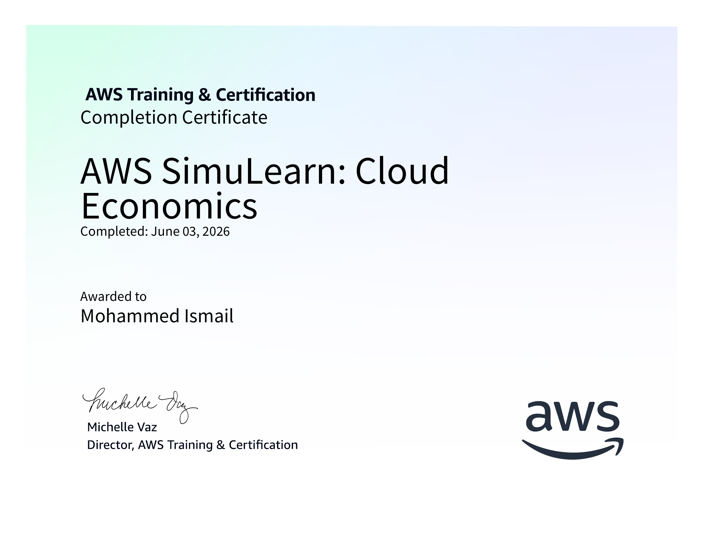
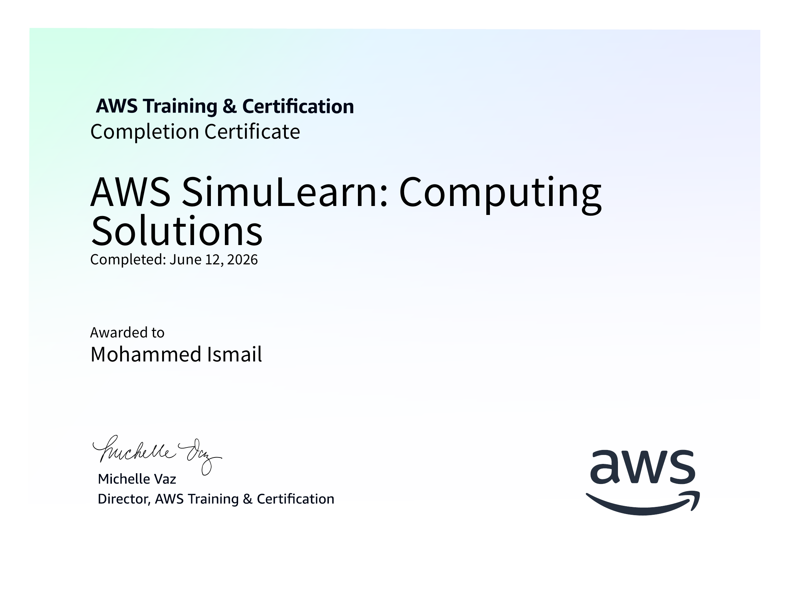
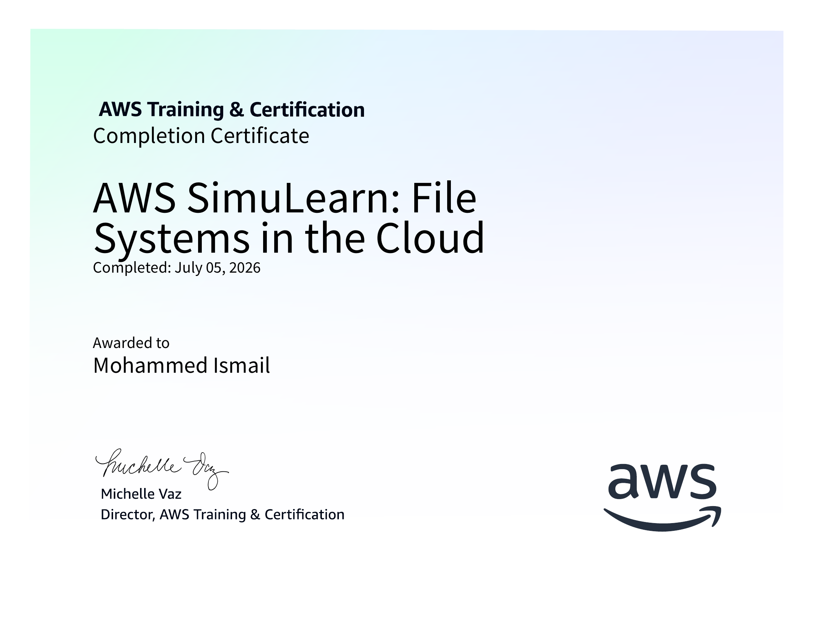

# Certificates and Badges

## About The Certificates

### Cloud First Steps
Implementation of Amazon EC2 instances across multiple Availability Zones in order to increase the reliability and availability of the current stabilization system.

---

### Cloud Computing Essentials
Implementation of a static webpage hosting solution using Amazon S3.

---

### Cloud Economics
Calculation of costs for a multi-service AWS architecture by using AWS Pricing Calculator and the Evaluation of cost optimization strategies for AWS services.

---

### Highly Available Web Applications
Implementation of auto-scaling with Elastic Load Balancing and health monitoring and evaluation of scaling strategies for different workload patterns.

### Computing Solutions
Adjustment of EC2 instance sizes to accommodate larger workloads.

---

### File Systems in the Cloud
Management and configuration of cloud-based file systems and storage solutions.

---

## Quick Links
- [Cloud First Steps](Cloud_First_Steps_certificate.png)
- [Cloud Computing Essentials](Cloud_Computing_Essentials.png)
- [Cloud Economics](Cloud_Economics.png)
- [Highly Available Web Applications](Highly_Available_Web_Applications.png)
- [Computing Solutions](Computing_Solutions.png)
- [File Systems in the Cloud](File_Systems_in_the_Cloud.png)
