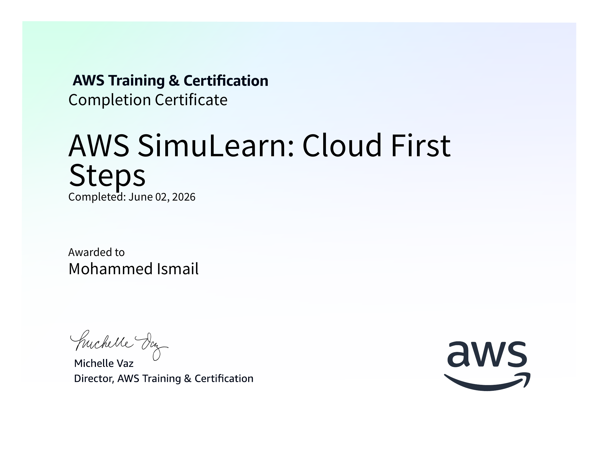
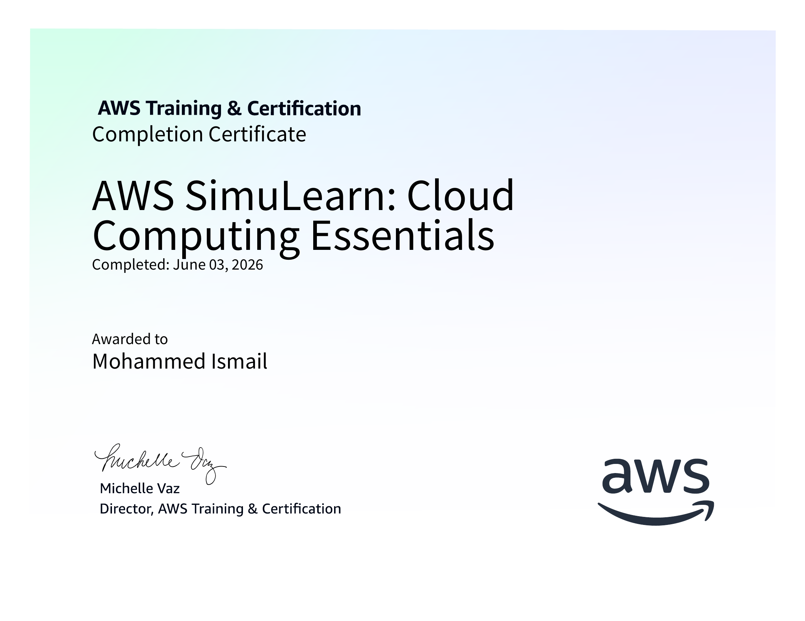
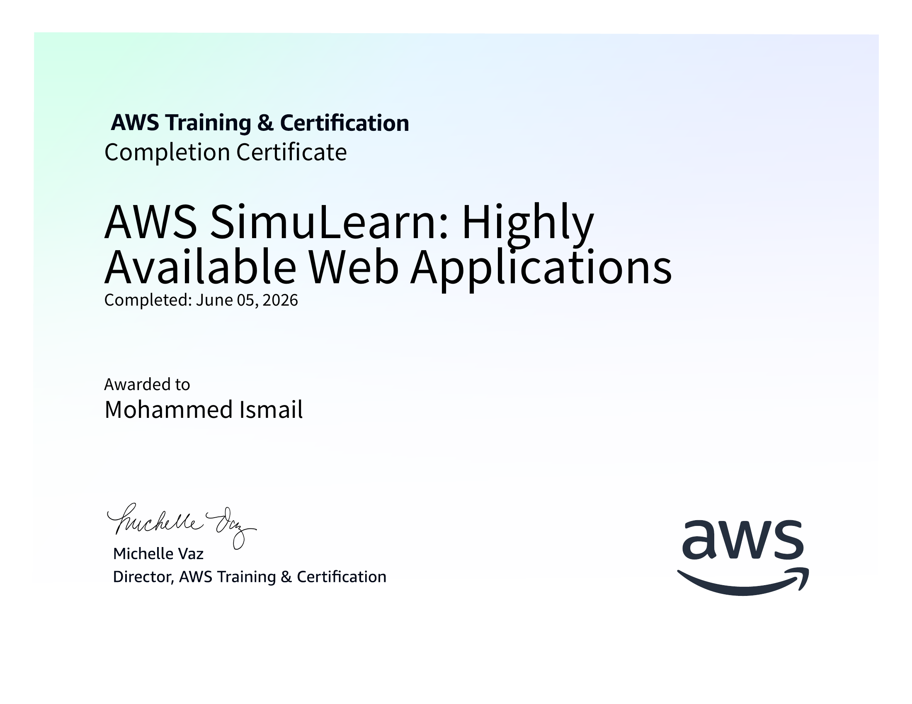
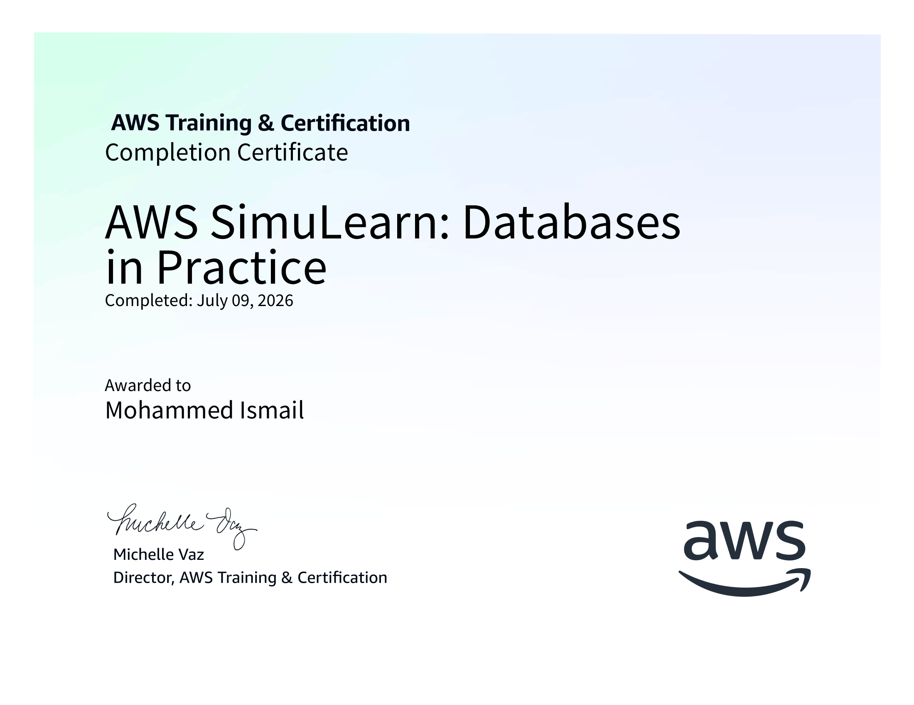
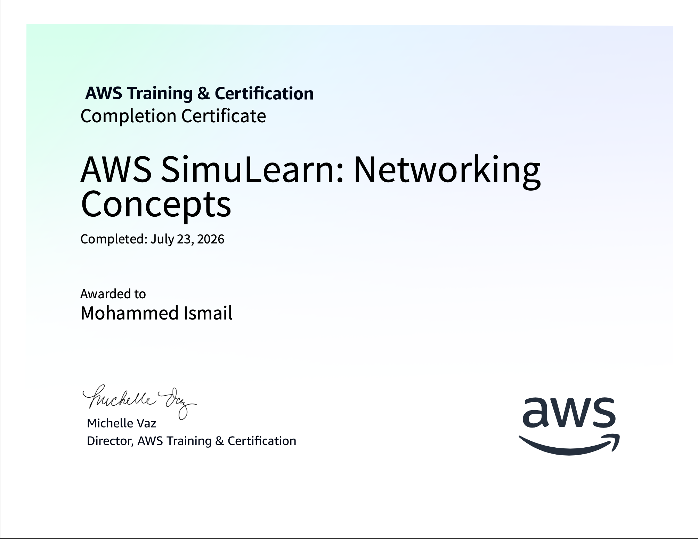
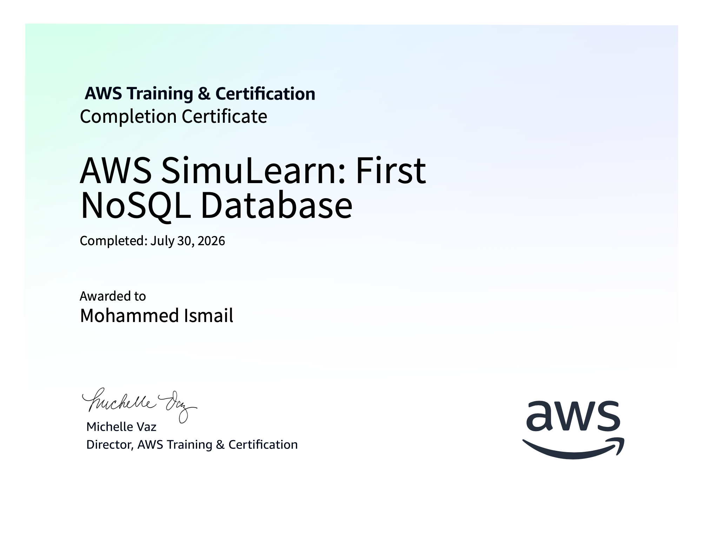
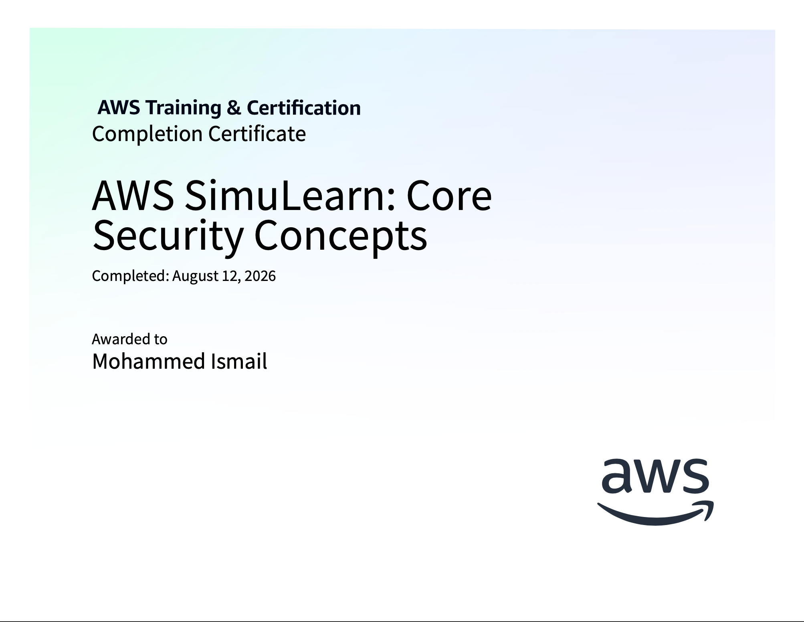

# Certificates and Badges

## About The Certificates

### Cloud First Steps
Implementation of Amazon EC2 instances across multiple Availability Zones in order to increase the reliability and availability of the current stabilization system.

---

### Cloud Computing Essentials
Implementation of a static webpage hosting solution using Amazon S3.

---

### Cloud Economics
Calculation of costs for a multi-service AWS architecture by using AWS Pricing Calculator and the Evaluation of cost optimization strategies for AWS services.

---

### Highly Available Web Applications
Implementation of auto-scaling with Elastic Load Balancing and health monitoring and evaluation of scaling strategies for different workload patterns.

---

### Computing Solutions
Adjustment of EC2 instance sizes to accommodate larger workloads.

---

### File Systems in the Cloud
Management and configuration of cloud-based file systems and storage solutions.

---

### Databases in Practice
Design and implementation of scalable database solutions using AWS Aurora and DynamoDB, with focus on adding in read replicas.

---

### Networking Concepts
Overview of networking fundamentals including VPCs, subnets, routing, and security groups as applied to AWS architectures.

---

### First NoSQL Database
Implementation of a NoSQL database solution using DynamoDB.

---

### Core Security Concepts
Implementation of IAM best practices for secure access management using the principle of least privilege.

## Quick Links
- [Cloud First Steps](Screenshots/Cloud_First_Steps_certificate.png)
- [Cloud Computing Essentials](Screenshots/Cloud_Computing_Essentials.png)
- [Cloud Economics](Screenshots/Cloud_Economics.png)
- [Highly Available Web Applications](Screenshots/Highly_Available_Web_Applications.png)
- [Computing Solutions](Screenshots/Computing_Solutions.png)
- [File Systems in the Cloud](Screenshots/File_Systems_in_the_Cloud.png)
- [Databases in Practice](Screenshots/Databases_in_Practice.png)
- [Networking Concepts](Screenshots/Networking_Concepts.png)
- [First NoSQL Database](Screenshots/First_noSQL_Database.png)
- [Core Security Concepts](Screenshots/Core_Security_Concepts.png)
