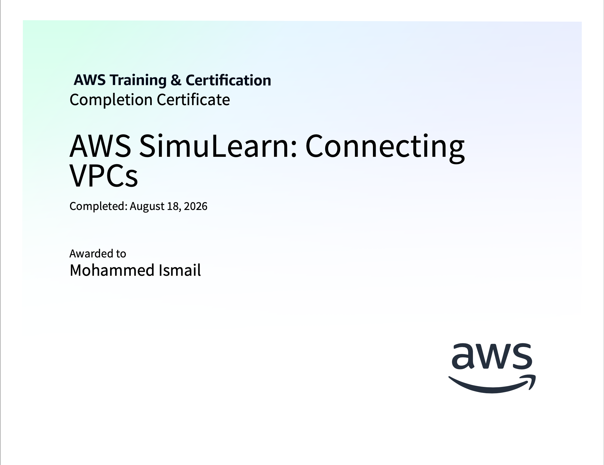
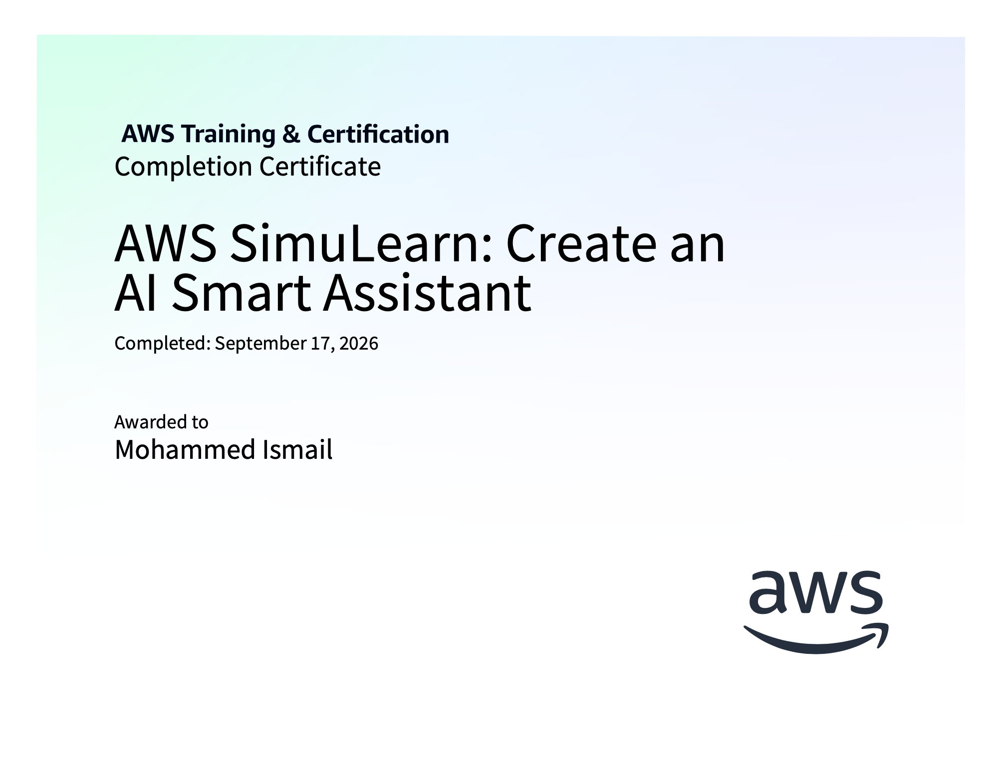
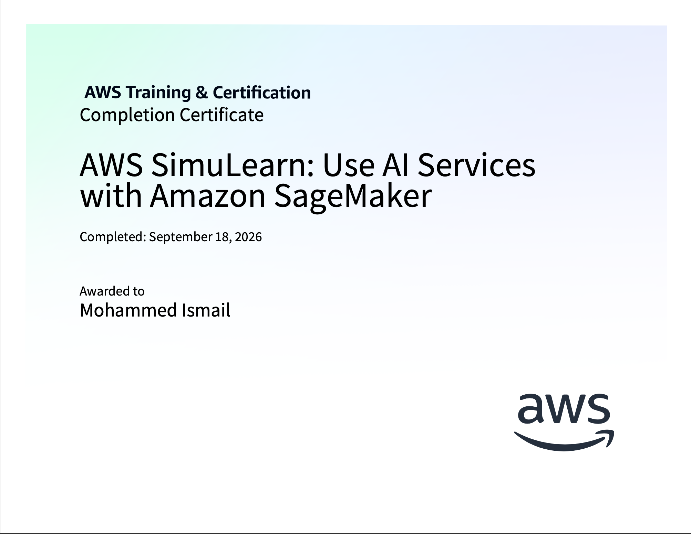

# Certificates and Badges

## About The Certificates

# $\color{#00aa00}{\text{Cloud First Steps}}$
Implementation of Amazon EC2 instances across multiple Availability Zones in order to increase the reliability and availability of the current stabilization system.

  

---

# $\color{#00aa00}{\text{Cloud Computing Essentials}}$
Implementation of a static webpage hosting solution using Amazon S3.

  

---

# $\color{#00aa00}{\text{Cloud Economics}}$
Calculation of costs for a multi-service AWS architecture by using AWS Pricing Calculator and the Evaluation of cost optimization strategies for AWS services.

  

---

# $\color{#00aa00}{\text{Highly Available Web Applications}}$
Implementation of auto-scaling with Elastic Load Balancing and health monitoring and evaluation of scaling strategies for different workload patterns.

  

---

# $\color{#00aa00}{\text{Computing Solutions}}$
Adjustment of EC2 instance sizes to accommodate larger workloads.

  

---

# $\color{#00aa00}{\text{File Systems in the Cloud}}$
Management and configuration of cloud-based file systems and storage solutions.

  

---

# $\color{#00aa00}{\text{Databases in Practice}}$
Design and implementation of scalable database solutions using AWS Aurora and DynamoDB, with focus on adding in read replicas.

  

---

# $\color{#00aa00}{\text{Networking Concepts}}$
Overview of networking fundamentals including VPCs, subnets, routing, and security groups as applied to AWS architectures.

  

---

# $\color{#00aa00}{\text{First NoSQL Database}}$
Implementation of a NoSQL database solution using DynamoDB.

  

---

# $\color{#00aa00}{\text{Core Security Concepts}}$
Implementation of IAM best practices for secure access management using the principle of least privilege.

  

---

# $\color{#00aa00}{\text{Connecting VPCs}}$
Analysis and implementation of subnet-specific VPC peering configurations using EC2 and VPC services.

  

---

# $\color{#00aa00}{\text{Create an AI Smart Assistant}}$
Creation of a smart assistant for company HR information and requests.

  

---

# $\color{#00aa00}{\text{Use AI Services}}$
Use AI Services with Amazon SageMaker AI to view, transcribe and verify audio output recorded in S3.

  

## Quick Links
- [Cloud First Steps](Screenshots/Cloud_First_Steps_certificate.png)
- [Cloud Computing Essentials](Screenshots/Cloud_Computing_Essentials.png)
- [Cloud Economics](Screenshots/Cloud_Economics.png)
- [Highly Available Web Applications](Screenshots/Highly_Available_Web_Applications.png)
- [Computing Solutions](Screenshots/Computing_Solutions.png)
- [File Systems in the Cloud](Screenshots/File_Systems_in_the_Cloud.png)
- [Databases in Practice](Screenshots/Databases_in_Practice.png)
- [Networking Concepts](Screenshots/Networking_Concepts.png)
- [First NoSQL Database](Screenshots/First_noSQL_Database.png)
- [Core Security Concepts](Screenshots/Core_Security_Concepts.png)
- [Connecting VPCs](Screenshots/Connecting_VPCs.png)
- [Create an AI Smart Assistant](Screenshots/Create_An_AI_Smart_Assistant.png)
- [Use AI Services](Screenshots/Use_AI_Services)
