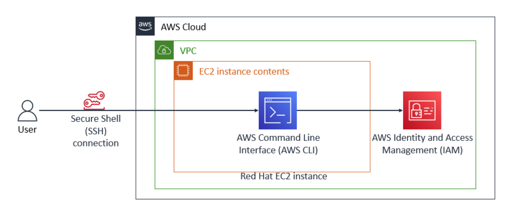
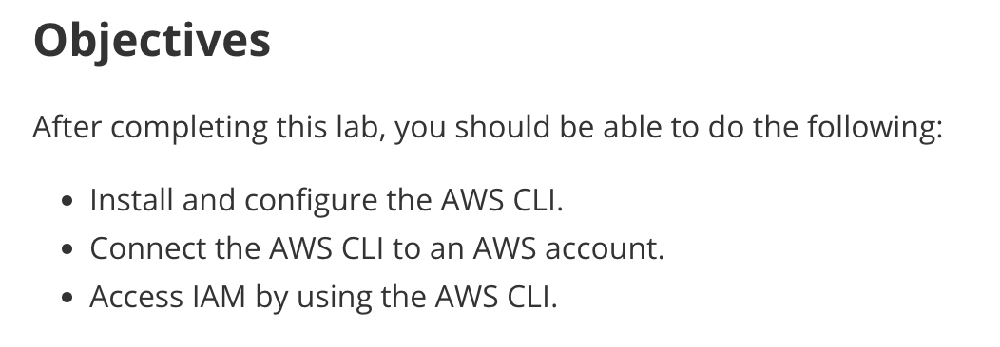
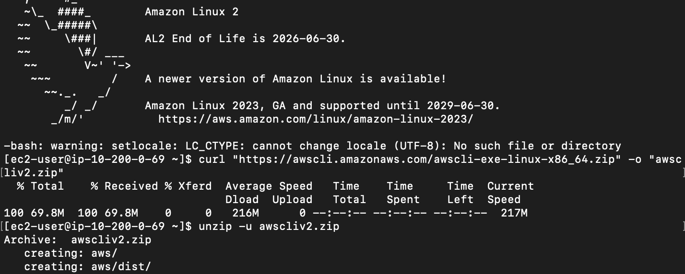
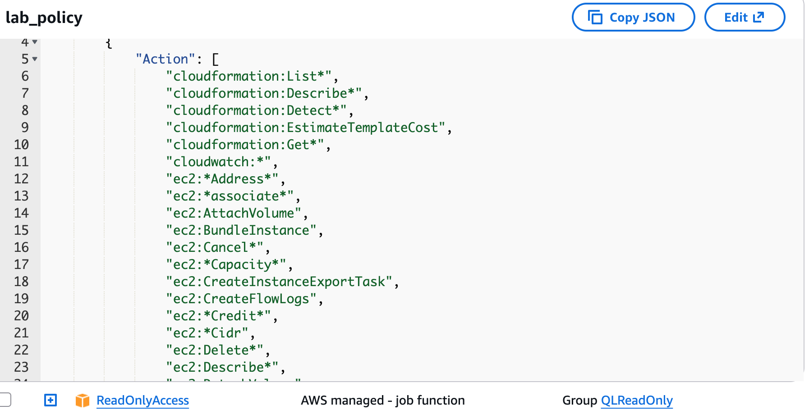
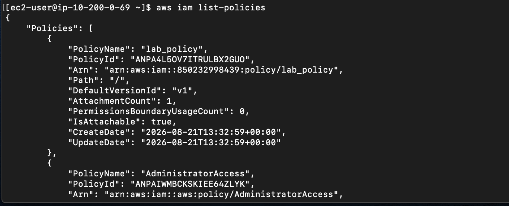
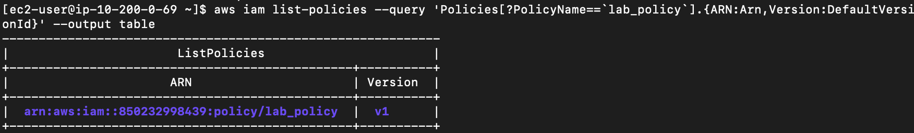
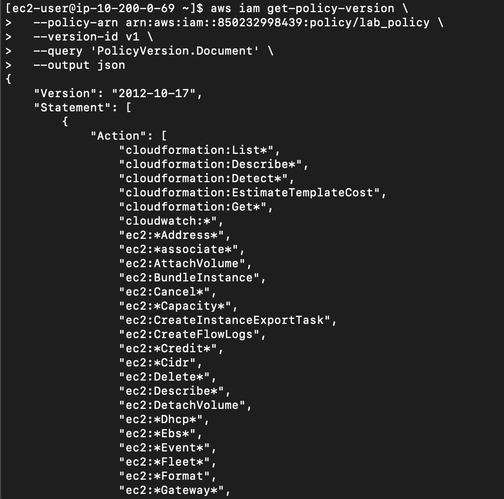

<h1 style="color:green">AWS CLI Configuration & IAM Policy Lab</h1>

<h2 style="color:green">Architecture</h2>



I connected via SSH to an EC2 instance inside a VPC. From this instance, I used the AWS CLI to communicate directly with AWS IAM.
---

<h2 style="color:green">Objectives</h2>



- Install and configure the AWS CLI
- Connect the AWS CLI to an AWS account
- Access IAM using the AWS CLI

---

<h2 style="color:green">1. Installing AWS CLI on the EC2 Instance</h2>



I downloaded and unpacked the AWS CLI version 2 installation package:

```bash
curl "https://awscli.amazonaws.com/awscli-exe-linux-x86_64.zip" -o "awscliv2.zip"
unzip -u awscliv2.zip
```

---

<h2 style="color:green">2. Observing the `lab_policy` in the AWS Console.</h2>

I inspected the lab_policy document directly in the AWS Management Console to review its granted permissions across CloudFormation, CloudWatch, and EC2 actions. The `lab_policy` document is a cust[...]



---

<h2 style="color:green">3. Listing All IAM Policies via CLI.</h2>



I queried the IAM service to list all available policies in the account:

```bash
aws iam list-policies
```

This Confirmed that `lab_policy` had existed with:
- **ARN:** `arn:aws:iam::850232998439:policy/lab_policy`
- **Default Version:** `v1`

---

<h2 style="color:green">4. Finding the Policy ARN and Version ID</h2>



I filtered the results using a JMESPath query to output the ARN and version ID in a structured table:

```bash
aws iam list-policies \
  --query 'Policies[?PolicyName==`lab_policy`].{ARN:Arn,Version:DefaultVersionId}' \
  --output table
```

---

<h2 style="color:green">5. Downloading the Policy Document as JSON</h2>



Using the retrieved ARN and version ID, I extracted the policy document directly as formatted JSON:

```bash
aws iam get-policy-version \
  --policy-arn arn:aws:iam::850232998439:policy/lab_policy \
  --version-id v1 \
  --query 'PolicyVersion.Document' \
  --output json
```

This query returned the full JSON-formatted IAM policy document which was identical to what is displayed in the AWS Management Console.
