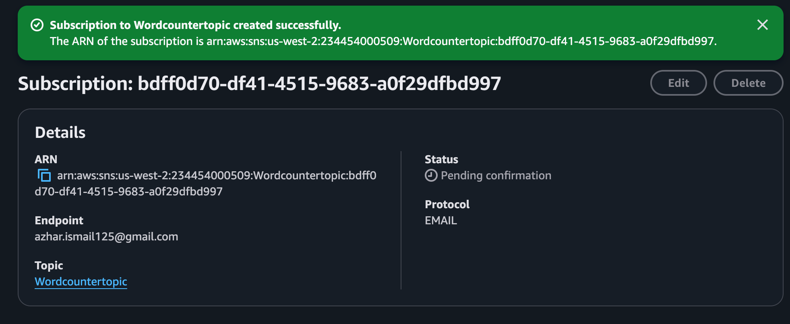
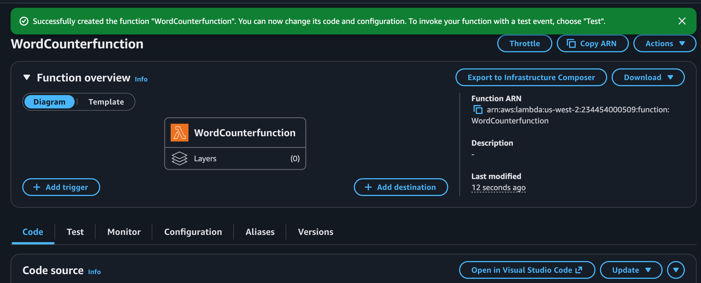
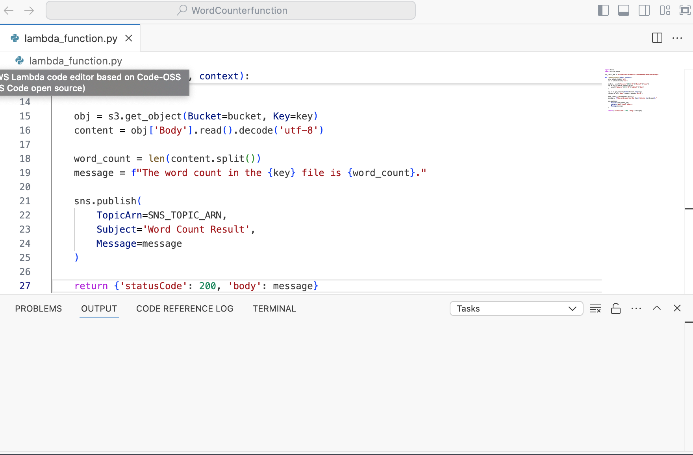
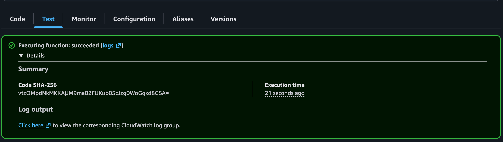
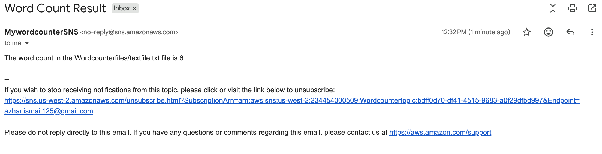
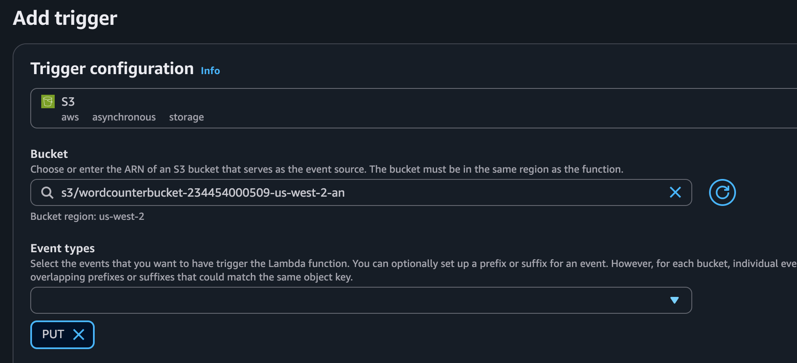
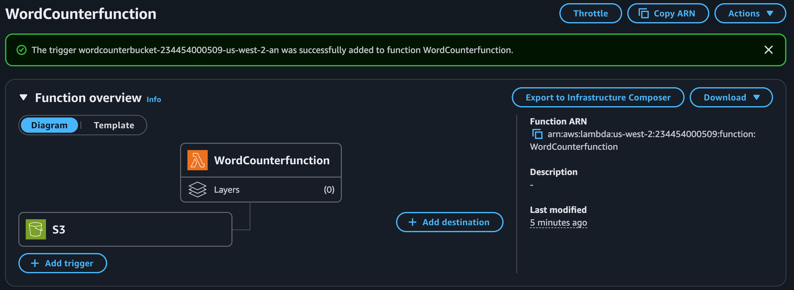
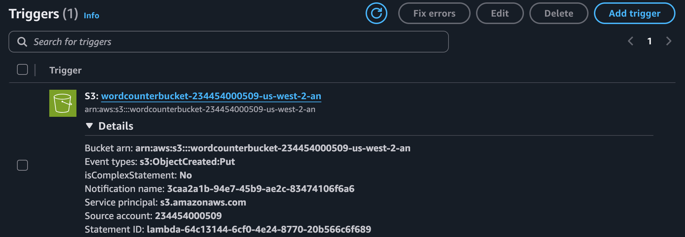
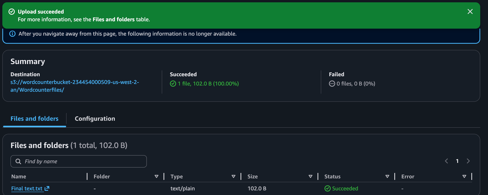
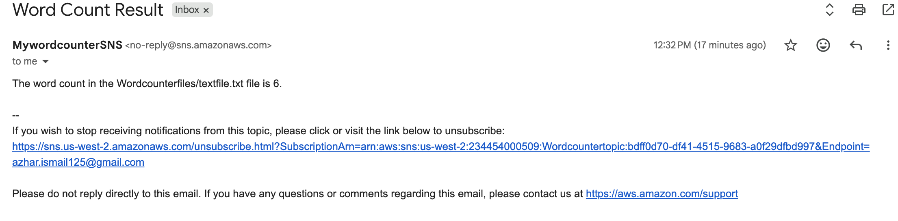

The goal of this lab was to build a serverless pipeline that automatically counts the words in any text file uploaded to S3 and delivers the result to an email address. No servers, no manual runs — [...]

The three AWS services used each play a distinct role: **S3** stores the files and detects uploads, **Lambda** runs the word count logic, and **SNS** handles the email delivery. 

---


```
S3 Bucket (PUT event)
        │
        ▼
AWS Lambda (WordCounterfunction)
        │
        ▼
SNS Topic (Wordcountertopic)
        │
        ▼
Email Notification
```

---


| Resource | Name |
|---|---|
| S3 Bucket | `wordcounterbucket-234454000509-us-west-2-an` |
| S3 Prefix | `Wordcounterfiles/` |
| Lambda Function | `WordCounterfunction` |
| SNS Topic | `Wordcountertopic` |
| Region | `us-west-2` |

---


### 1. SNS Topic & Subscription

I set up SNS (Simple Notification Service) first because Lambda needs the topic ARN added into its code. If the topic doesn't exist yet then, there's nothing to publish to.

I used a **Standard** topic here rather than FIFO because in this case, the message order doesn't matter. I just need the email to arrive once it has been triggered to do so.

- SNS → Create topic → Standard → name: `Wordcountertopic`
- Create subscription → Protocol: **Email** → enter your email → **Create**
- Check your inbox and confirm the subscription link

> The subscription starts as *Pending Confirmation* until the designated recipient (me in this case) clicks the link in the email. Lambda still can publish to the topic before confirmation, but no[...]



---


### 2. Lambda Function

Lambda is a serverless compute service meaning that, it runs code in response to events without needing to provision or manage a server. The function only runs when triggered, which makes it cost-[...]

- Lambda → Create function → Author from scratch
- Name: `WordCounterfunction`
- Runtime: **Python 3.12**
- Execution role: create a new role with the following policies:
  - `AmazonS3ReadOnlyAccess` — to read the uploaded file
  - `AmazonSNSFullAccess` — to publish the result to the topic
  - `AWSLambdaBasicExecutionRole` — to write logs to CloudWatch

> IAM permissions are scoped deliberately. Lambda only needs to *read* from S3, not write — so `ReadOnly` is the right choice. The principle of Least Privilege is a core AWS security best practi[...]



---


### 3. Function Code

This function accomplishes four tasks in sequence: 1. Extract the bucket and file details from the incoming S3 event, 2. Read the file contents, 3. Count the words and 4. Publish the result to SNS[...]

```python
import boto3
import urllib.parse

SNS_TOPIC_ARN = 'arn:aws:sns:us-west-2:234454000509:Wordcountertopic'

def lambda_handler(event, context):
    s3 = boto3.client('s3')
    sns = boto3.client('sns')

    bucket = event['Records'][0]['s3']['bucket']['name']
    key = urllib.parse.unquote_plus(
        event['Records'][0]['s3']['object']['key']
    )

    obj = s3.get_object(Bucket=bucket, Key=key)
    content = obj['Body'].read().decode('utf-8')

    word_count = len(content.split())
    message = f"The word count in the {key} file is {word_count}."

    sns.publish(
        TopicArn=SNS_TOPIC_ARN,
        Subject='Word Count Result',
        Message=message
    )

    return {'statusCode': 200, 'body': message}
```

To add on:

- `urllib.parse.unquote_plus` was used when extracting the file key because the S3 URL-encodes file names that contain spaces or special characters. Without this, a file named `Final text.txt` wo[...]
- `content.split()` splits on any whitespace by default — spaces, tabs, newlines — which provided an accurate word count regardless of how the file was formatted.
- The SNS_topic_ARN was defined as a constant at the top of the file rather than hardcoded inside the function, so if I need to update it in the future, I wouldn't need to get into the code too m[...]



---


### 4. Testing with a Simulated Event

Before setting up the S3 trigger, I tested the function in isolation using a manually crafted event. The thinking was to catch any bugs in the code before the trigger instruction kicked in.

Lambda's test event simulates the JSON payload that S3 would send when a file is uploaded:

```json
{
  "Records": [
    {
      "s3": {
        "bucket": {
          "name": "wordcounterbucket-234454000509-us-west-2-an"
        },
        "object": {
          "key": "Wordcounterfiles/textfile.txt"
        }
      }
    }
  ]
}
```

> The `key` must match a file that actually exists in the bucket which was the one entitled `textfile.txt` in this case. Lambda will try to call `s3.get_object()` with that key. and if the file i[...]



The test passed and the SNS email arrived shortly after, confirming the function logic and permissions were both working correctly.



---


### 5. S3 Trigger

With the function validated, the next step was to connect S3 so that the uploads fire the function automatically. This was done by adding an event notification on the bucket that invokes Lambda o[...]

- Lambda → `WordCounterfunction` → **Add trigger**
- Source: **S3**
- Bucket: `wordcounterbucket-234454000509-us-west-2-an`
- Event type: **PUT**
- Prefix: `Wordcounterfiles/`

> The prefix filter is important. Without it, any file uploaded anywhere in the bucket, would trigger the function. Scoping it to `Wordcounterfiles/` keeps the trigger focused on files inside the[...]







---


With the trigger in place, the final test was to upload a new file directly to the S3 bucket and wait for the email with no manual Lambda invocation involved.

`Final text.txt` was uploaded to `Wordcounterfiles/` via the S3 console:



The upload fired the PUT event, Lambda executed automatically, and the word count email arrived:



---


```
Subject: Word Count Result

The word count in the Wordcounterfiles/textfile.txt file is 6.
```

---


- **SNS subscriptions must be confirmed** before any emails are delivered. The subscription stays in *Pending* state until the user clicks the confirmation link. I admit this was easy to miss res[...]
- **CloudWatch Logs** are the first place to check when something goes wrong. Every Lambda invocation writes a log stream to `/aws/lambda/WordCounterfunction`, including the full error traceback [...]
- **ARNs are service-specific.** Early in the lab, I assumed that all ARN's in the lab were the same which led to the SNS topic ARN being replaced with the Lambda function ARN and finally resulti[...]
- **Test events and function code are independent.** The test event is *really just a test* used to invoke the function manually so it doesn't need to match the code in any structural way beyond [...]
