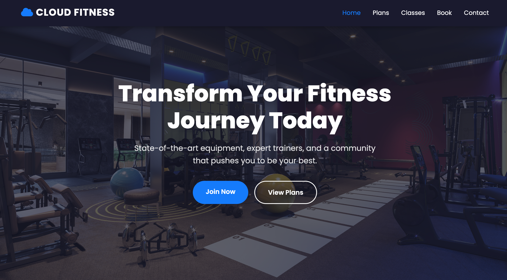
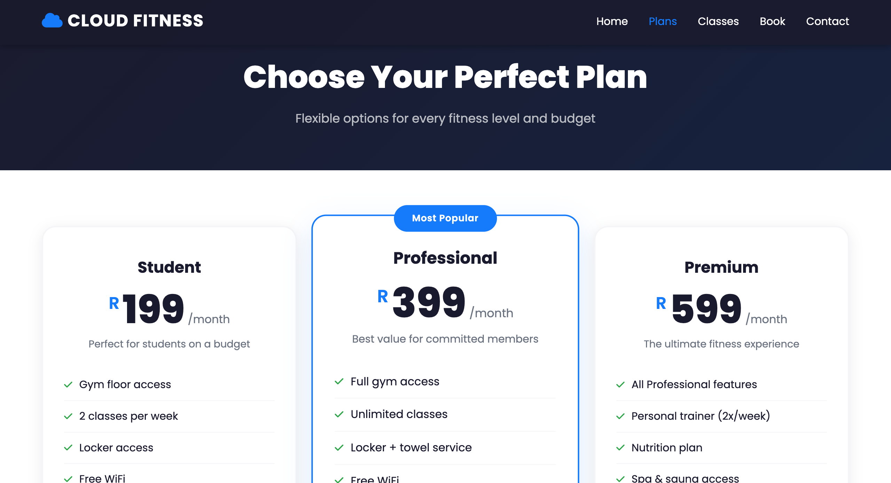
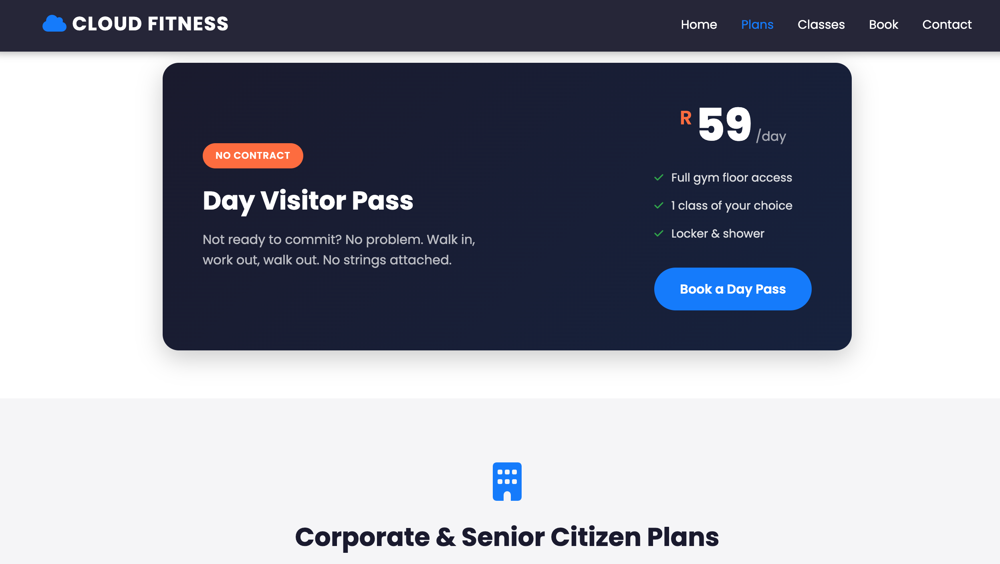
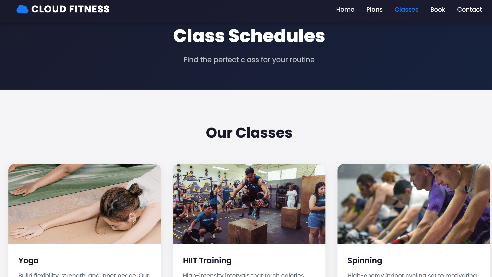
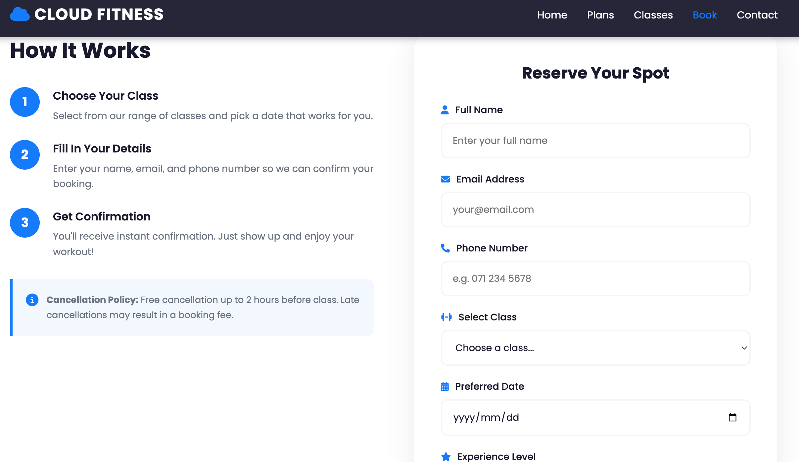
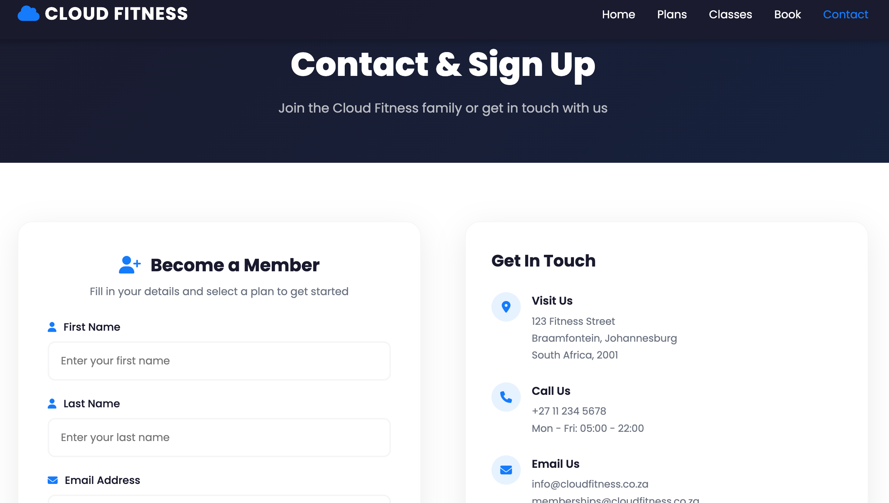
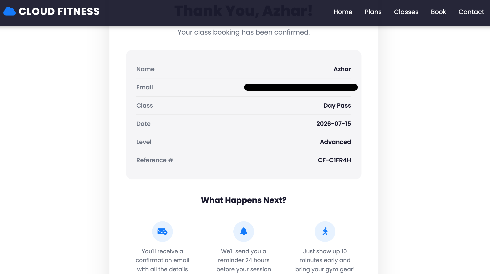
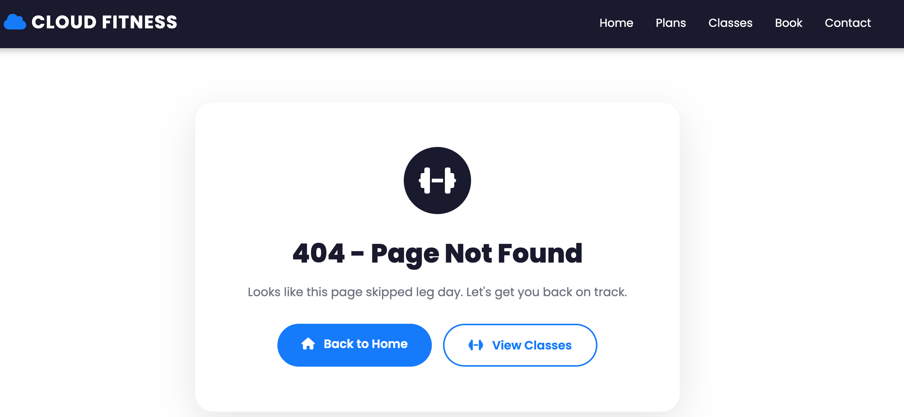

# Website Breakdown

Static site built for Cloud Fitness Gym, deployed to Amazon S3.

## Stack
- HTML5, CSS3, vanilla JavaScript — no framework, no build step
- Font Awesome (icons), Google Fonts (Poppins) — loaded via CDN
- Google Maps embed on the contact page

## Pages

| Page | Screenshot | Purpose |
|---|---|---|
| Home |  | Home, "why choose us" features, featured classes preview |
| Plans |   | Pricing tiers (Student / Professional / Premium), day pass, corporate & senior r[...]|
| Classes |  | Class descriptions + filterable weekly schedule table (by day) |
| Booking |  | Class booking form → submits to `confirmation.html` |
| Contact |  | Membership sign-up form + gym contact details and map → submits to `confirmation.html` |
| Confirmation |  | Reads submitted form data from the URL and displays a booking/sign-up summary with a generated reference number |
| Error |  | Custom 404, set as the S3 error document |

Source files: `index.html`, `plans.html`, `classes.html`, `booking.html`, `contact.html`, `confirmation.html`, `error.html`

## Shared components
- `styles.css` — single stylesheet covering layout, navbar, cards, forms, pricing grid, schedule table, and responsive breakpoints
- `main.js` — handles:
  - mobile nav toggle (hamburger menu)
  - scroll-based navbar background change
  - fade-in-on-scroll animation (feature/class cards, section titles)
  - class schedule day-filter tabs
  - confirmation page: reads query parameters from the booking/sign-up form submission and renders the details and reference number for the client's side.

## Design notes
- No backend — booking and sign-up "submissions" are simulated via GET form parameters.
- Fully static, so it maps directly onto S3 static website hosting with no server required.
